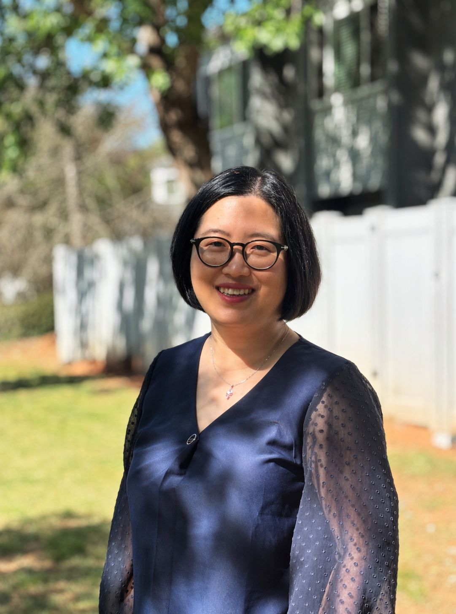

```{=html}
<style>

/* Photo only: keep float layout; add top space so the image visually aligns with the text */
.headshot {
  float: left;
  width: 297px;
  height: auto;
  margin: 1.4rem 2rem 1.5rem 0;
  border-radius: 8px;
}

/* Greeting line */
.greeting {
  display: block;
  margin-top: 0;
  margin-bottom: 1rem;
}

/* Remove underline but preserve theme link color */
main a {
  text-decoration: none !important;
}

</style>
```


[Hello! Thank you for visiting my website.]{.greeting}

I am Meng Ye, a Ph.D. Candidate in Public Policy at *Georgia State University* and an incoming Assistant Professor at the [Department of Public and Nonprofit Administration](https://preview.memphis.edu/padm/programs/index.php) at the *University of Memphis*. [My research](/research/pipeline.qmd) examines the roles of mission-driven organizations amid blurring sector boundaries, including social entrepreneurship, government retrenchment, and cross-sector collaboration. I also study nonprofit finance, global civil society and regulations.

My work has appeared in [*Public Performance & Management Review*](https://doi.org/10.1080/15309576.2025.2593642), [*Journal of Asian Public Policy*](https://www.tandfonline.com/doi/abs/10.1080/17516234.2020.1824263), [*Nonprofit Policy Forum*](https://www.degruyterbrill.com/document/doi/10.1515/npf-2022-0014/html), and [*Academy of Management Proceedings*](https://journals.aom.org/doi/epdf/10.5465/AMPROC.2023.155bp), among others. My research has been recognized by the [AOM PNP Section Best Conference Paper Award](https://www.linkedin.com/posts/rebeccatekula_aom2023-activity-7079936050055245824-ZdjA?utm_source=share&utm_medium=member_desktop&rcm=ACoAAAgcY3oBCh29bxUuNTZETfJaqIzYHSXe8Vc) and the ARNOVA NPPFM Section Woods Bowman Student Award, and supported by multiple [academic grants](awards.qmd).

I am grateful for the mentorship of a vibrant research community, including the [APPAM Equity & Inclusion Fellowship](https://www.appam.org/about-appam/awards/2022-equity-inclusion-fellowship-student-recipients/), ARNOVA Doctoral Fellows, and NML-ESS Nonprofit Early Scholars Fellowship, and I strive to give back by serving as [Editorial Manager of the *International Journal of Public Administration*](https://www.tandfonline.com/journals/lpad20/about-this-journal#editorial-board), as a member of the [ARNOVA Development Committee](https://www.arnova.org/committees/), and as a peer reviewer for several journals.

Before pursuing my Ph.D., I spent six years working in think tanks, advising organizations such as the [Asian Development Bank](https://www.adb.org/projects/45514-001/main) and leading research and consultancy projects funded by the Ford Foundation and the Gates Foundation. I take pride in my [diverse disciplinary background](/about.qmd). As a lawyer turned statistics enthusiast, I strive to combine the richness of stories and contextual detail with the rigor and generalizability of systematic analysis to help solve the pressing challenges of our shared communities.
